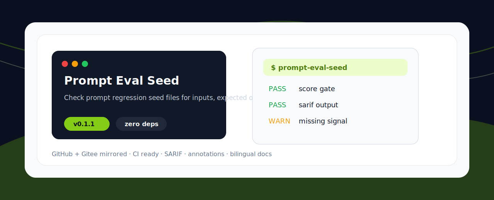
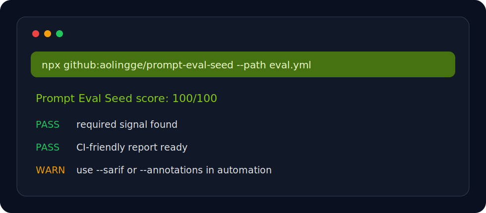

<p align="center">
  
</p>

<h1 align="center">Prompt Eval Seed</h1>

<p align="center">检查 prompt 回归测试种子是否包含输入、预期输出、失败案例和安全说明。</p>

<p align="center"><a href="README.md">English</a> · <a href="#快速开始">快速开始</a> · <a href="#检查项">检查项</a></p>

<p align="center">
  
  
  
</p>

<p align="center">
  
</p>

## 为什么做这个

AI Agent 工具链正在快速增长，但很多仓库缺少能直接放进 CI 或本地预检的小工具。这个项目保持零依赖、命令短、输出清楚，适合被收藏、fork、二次改造。

## 快速开始

```bash
npx github:aolingge/prompt-eval-seed --path eval.yml
```

Generate Markdown:

```bash
npx github:aolingge/prompt-eval-seed --path eval.yml --markdown > report.md
```

Use a score gate:

```bash
npx github:aolingge/prompt-eval-seed --path eval.yml --min-score 80
```

## 检查项

| Check | What it looks for |
| --- | --- |
| input | Defines input cases. |
| expected | Defines expected behavior. |
| negative | Includes negative or edge cases. |
| safety | Includes safety notes. |

## Output

```text
Prompt Eval Seed score: 100/100
PASS  example-check  Useful signal found
FAIL  missing-check  Add the missing guidance
```

## 参与贡献

Good first PRs: add checks, add fixtures, improve docs, or add GitHub Actions examples.

## License

MIT


## Quality Gate

Use this project as a repeatable gate before an AI agent marks work as done:

- [Quality gate guide](docs/quality-gates.md)
- [Copy-ready GitHub Actions example](examples/github-action.yml)

